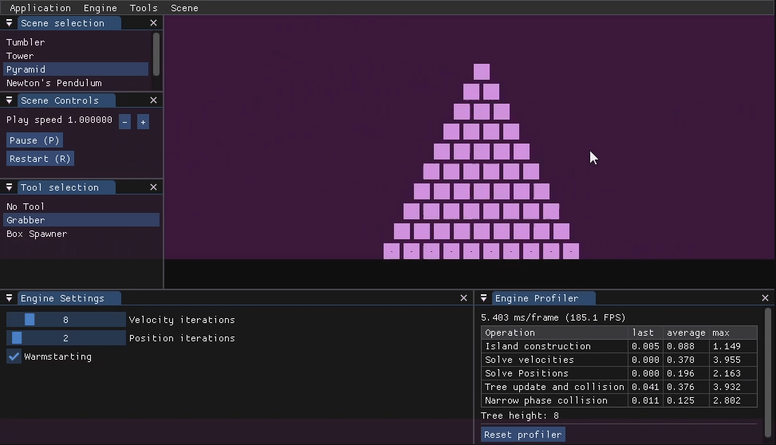

# Simu
Simu is an impulse based 2D physics engine for real-time simulation of rigid bodies. 

The `app` module provides a testbench to which any number of `Scene` can be attached. The test bench will show profiling data for the scene, allows the user to grab objects, pause, reset the scene, etc.

Simu resolves collisions by solving colliding object pairs iteratively, the limitations of this model can be seen below when simulating Newton's pendulum. When multiple `Collider` with a non-zero bounciness in their `Material` are colliding in a single frame, the solver fails to produce the expected result. (Notice how we end up with a 1-2-2 pattern from a 2-3 initial state)

# Documentation

Set the CMake variable `SIMU_BUILD_DOCS` to `ON` and build the `Simu-docs` target. The documentation can be opened from `docs/out/index.html`.

__Documentation is largely incomplete__

Refer to `test/Physics.cpp` and `demos/` for examples.

# Installation

## Building with CMake
System-wide installation is not yet supported, the recommended installation is to build Simu within your project, either with CMake's fetch content or as a git submodule.

In both cases, the following libraries can be linked against:
- `simu-physics` to only use the engine
- `simu-app` (implies `simu-physics`) to use the testbench used for demos

Your target should have the proper include directories simply by linking to Simu's libraries. Use `#include "Simu/physics.hpp"` or `#include "Simu/app.hpp"` according to the features you want.
